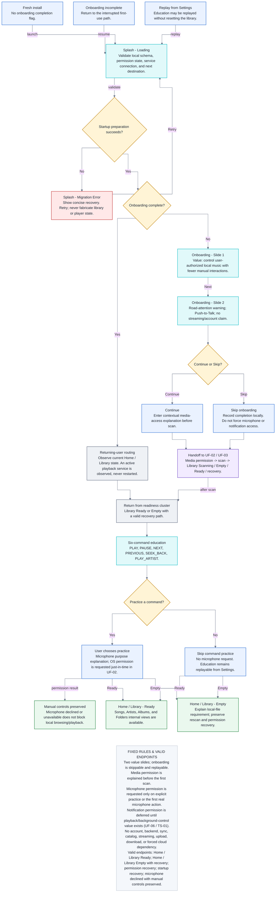

# UF-01 - First Launch and Education

```mermaid
%%{init: {"theme": "base", "flowchart": {"curve": "stepAfter", "nodeSpacing": 45, "rankSpacing": 60, "htmlLabels": true}, "themeVariables": {"fontFamily": "Inter, Arial, sans-serif", "fontSize": "15px", "lineColor": "#667085", "textColor": "#1F2633"}}}%%
flowchart TB

    FRESH["Fresh install<br/>No onboarding completion flag."]
    INCOMPLETE["Onboarding incomplete<br/>Return to the interrupted first-use path."]
    REPLAY["Replay from Settings<br/>Education may be replayed without resetting the library."]

    FRESH -->|launch| SPLASH
    INCOMPLETE -->|resume| SPLASH
    REPLAY -->|replay| SPLASH

    SPLASH["Splash - Loading<br/>Validate local schema, permission state, service connection, and next destination."]
    SPLASH -->|validate| STARTUP{"Startup preparation succeeds?"}

    STARTUP -->|No| MIGRATION["Splash - Migration Error<br/>Show concise recovery. Retry; never fabricate library or player state."]
    MIGRATION -->|Retry| SPLASH

    STARTUP -->|Yes| ONBOARDING{"Onboarding complete?"}

    ONBOARDING -->|Yes| RETURNING["Returning-user routing<br/>Observe current Home / Library state. An active playback service is observed, never restarted."]

    ONBOARDING -->|No| SLIDE1["Onboarding - Slide 1<br/>Value: control user-authorized local music with fewer manual interactions."]
    SLIDE1 -->|Next| SLIDE2["Onboarding - Slide 2<br/>Road-attention warning; Push-to-Talk; no streaming/account claim."]
    SLIDE2 --> CONTINUE_OR_SKIP{"Continue or Skip?"}

    CONTINUE_OR_SKIP -->|Continue| CONTINUE["Continue<br/>Enter contextual media-access explanation before scan."]
    CONTINUE_OR_SKIP -->|Skip| SKIP["Skip onboarding<br/>Record completion locally. Do not force microphone or notification access."]

    CONTINUE --> HANDOFF["Handoff to UF-02 / UF-03<br/>Media permission -> scan -> Library Scanning / Empty / Ready / recovery."]
    SKIP --> HANDOFF

    RETURNING --> READINESS_RETURN["Return from readiness cluster<br/>Library Ready or Empty with a valid recovery path."]
    HANDOFF -->|after scan| READINESS_RETURN

    READINESS_RETURN --> EDUCATION["Six-command education<br/>PLAY, PAUSE, NEXT, PREVIOUS, SEEK_BACK, PLAY_ARTIST."]
    EDUCATION --> PRACTICE{"Practice a command?"}

    PRACTICE -->|Yes| PRACTICE_VOICE["User chooses practice<br/>Microphone purpose explanation; OS permission is requested just-in-time in UF-02."]
    PRACTICE -->|No| SKIP_PRACTICE["Skip command practice<br/>No microphone request. Education remains replayable from Settings."]

    PRACTICE_VOICE -->|permission result| MANUAL["Manual controls preserved<br/>Microphone declined or unavailable does not block local browsing/playback."]
    PRACTICE_VOICE -->|Ready| READY["Home / Library - Ready<br/>Songs, Artists, Albums, and Folders internal views are available."]
    PRACTICE_VOICE -->|Empty| EMPTY["Home / Library - Empty<br/>Explain local-file requirement; preserve rescan and permission recovery."]

    SKIP_PRACTICE -->|Ready| READY
    SKIP_PRACTICE -->|Empty| EMPTY

    RULES["FIXED RULES & VALID ENDPOINTS<br/>Two value slides; onboarding is skippable and replayable.<br/>Media permission is explained before the first scan.<br/>Microphone permission is requested only on explicit practice or the first real microphone action.<br/>Notification permission is deferred until playback/background-control value exists (UF-06 / TS-01).<br/>No account, backend, sync, catalog, streaming, upload, download, or forced cloud dependency.<br/>Valid endpoints: Home / Library Ready; Home / Library Empty with recovery; permission recovery; startup recovery; microphone declined with manual controls preserved."]

    READY ~~~ RULES
    EMPTY ~~~ RULES
    MANUAL ~~~ RULES

    classDef start fill:#EAF2FF,stroke:#3776D6,color:#1F2633,stroke-width:1.5px;
    classDef state fill:#E1F9FA,stroke:#16BEC7,color:#1F2633,stroke-width:1.5px;
    classDef decision fill:#FFF4D6,stroke:#C68817,color:#1F2633,stroke-width:1.5px;
    classDef action fill:#EAF2FF,stroke:#3776D6,color:#1F2633,stroke-width:1.5px;
    classDef recovery fill:#FFE8E8,stroke:#C63B3B,color:#1F2633,stroke-width:1.5px;
    classDef route fill:#EEF1F5,stroke:#667085,color:#1F2633,stroke-width:1.5px;
    classDef handoff fill:#F2EBFF,stroke:#7650C7,color:#1F2633,stroke-width:1.5px;
    classDef terminal fill:#EAF8EE,stroke:#2E8B4B,color:#1F2633,stroke-width:1.5px;
    classDef note fill:#F4F7FB,stroke:#C7CED9,color:#1F2633,stroke-width:1.5px;

    class FRESH,INCOMPLETE,REPLAY start;
    class SPLASH,SLIDE1,SLIDE2,EDUCATION state;
    class STARTUP,ONBOARDING,CONTINUE_OR_SKIP,PRACTICE decision;
    class CONTINUE,SKIP,PRACTICE_VOICE,SKIP_PRACTICE action;
    class MIGRATION recovery;
    class RETURNING,READINESS_RETURN route;
    class HANDOFF handoff;
    class READY,EMPTY,MANUAL terminal;
    class RULES note;
```
