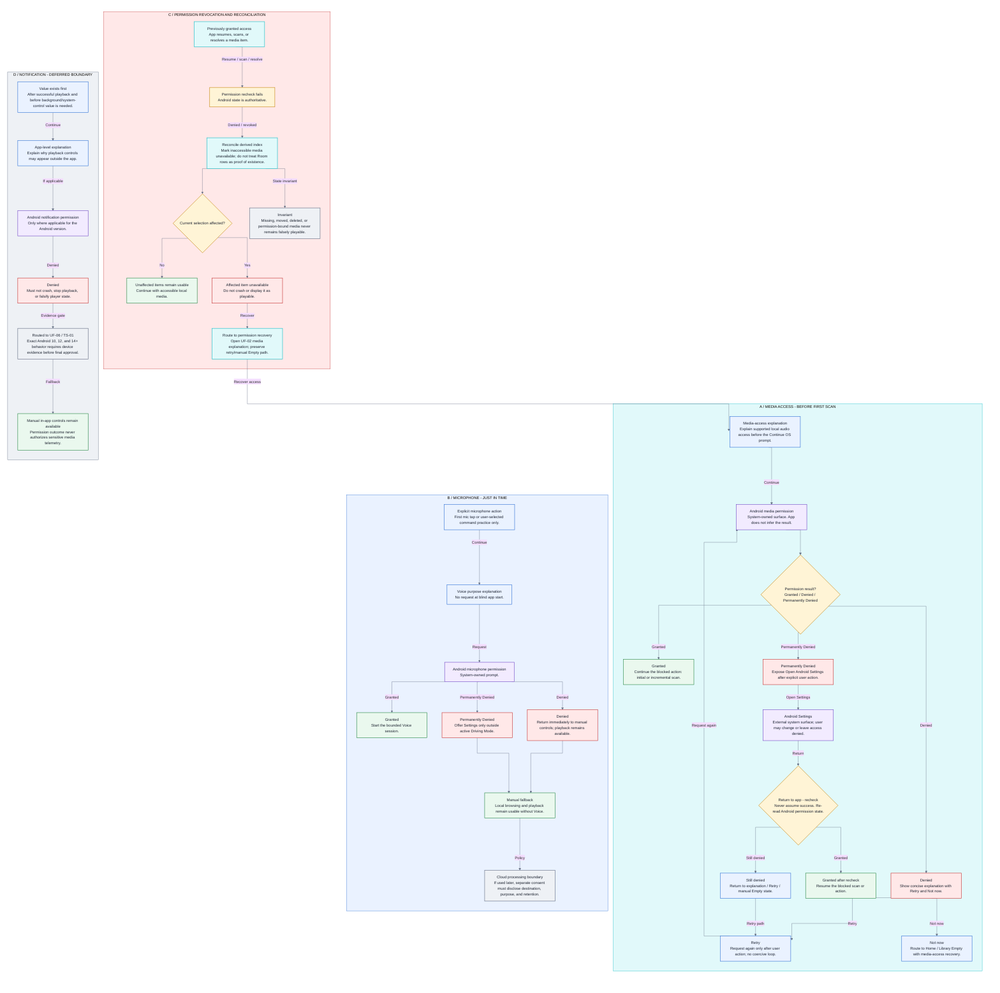

```mermaid
%%{init: {"theme": "base", "flowchart": {"curve": "stepAfter", "nodeSpacing": 55, "rankSpacing": 72, "htmlLabels": true}, "themeVariables": {"fontFamily": "Inter, Arial, sans-serif", "fontSize": "14px", "lineColor": "#667085", "textColor": "#1F2633"}}}%%
flowchart TB

    subgraph ROW_TOP[" "]
        direction LR

        subgraph A["A / MEDIA ACCESS - BEFORE FIRST SCAN"]
            direction TB

            A_EXPLAIN["Media-access explanation<br/>Explain supported local audio access before the Continue OS prompt."]
            A_DIALOG["Android media permission<br/>System-owned surface. App does not infer the result."]
            A_RESULT{"Permission result?<br/>Granted / Denied / Permanently Denied"}

            A_GRANTED["Granted<br/>Continue the blocked action: initial or incremental scan."]
            A_DENIED["Denied<br/>Show concise explanation with Retry and Not now."]
            A_RETRY["Retry<br/>Request again only after user action; no coercive loop."]
            A_NOT_NOW["Not now<br/>Route to Home / Library Empty with media-access recovery."]

            A_PERMANENT["Permanently Denied<br/>Expose Open Android Settings after explicit user action."]
            A_SETTINGS["Android Settings<br/>External system surface; user may change or leave access denied."]
            A_RECHECK{"Return to app - recheck<br/>Never assume success. Re-read Android permission state."}
            A_STILL_DENIED["Still denied<br/>Return to explanation / Retry / manual Empty state."]
            A_GRANTED_AFTER["Granted after recheck<br/>Resume the blocked scan or action."]

            A_EXPLAIN -->|Continue| A_DIALOG
            A_DIALOG --> A_RESULT

            A_RESULT -->|Granted| A_GRANTED
            A_RESULT -->|Denied| A_DENIED
            A_RESULT -->|Permanently Denied| A_PERMANENT

            A_DENIED -->|Retry| A_RETRY
            A_RETRY -->|Request again| A_DIALOG
            A_DENIED -->|Not now| A_NOT_NOW

            A_PERMANENT -->|Open Settings| A_SETTINGS
            A_SETTINGS -->|Return| A_RECHECK
            A_RECHECK -->|Granted| A_GRANTED_AFTER
            A_RECHECK -->|Still denied| A_STILL_DENIED
            A_STILL_DENIED -->|Retry path| A_RETRY
        end

        subgraph B["B / MICROPHONE - JUST IN TIME"]
            direction TB

            B_ACTION["Explicit microphone action<br/>First mic tap or user-selected command practice only."]
            B_EXPLAIN["Voice purpose explanation<br/>No request at blind app start."]
            B_DIALOG["Android microphone permission<br/>System-owned prompt."]

            B_GRANTED["Granted<br/>Start the bounded Voice session."]
            B_DENIED["Denied<br/>Return immediately to manual controls; playback remains available."]
            B_PERMANENT["Permanently Denied<br/>Offer Settings only outside active Driving Mode."]

            B_MANUAL["Manual fallback<br/>Local browsing and playback remain usable without Voice."]
            B_CLOUD["Cloud processing boundary<br/>If used later, separate consent must disclose destination, purpose, and retention."]

            B_ACTION -->|Continue| B_EXPLAIN
            B_EXPLAIN -->|Request| B_DIALOG

            B_DIALOG -->|Granted| B_GRANTED
            B_DIALOG -->|Denied| B_DENIED
            B_DIALOG -->|Permanently Denied| B_PERMANENT

            B_DENIED --> B_MANUAL
            B_PERMANENT --> B_MANUAL
            B_MANUAL -->|Policy| B_CLOUD
        end
    end

    subgraph ROW_BOTTOM[" "]
        direction LR

        subgraph C["C / PERMISSION REVOCATION AND RECONCILIATION"]
            direction TB

            C_PREVIOUS["Previously granted access<br/>App resumes, scans, or resolves a media item."]
            C_RECHECK["Permission recheck fails<br/>Android state is authoritative."]
            C_RECONCILE["Reconcile derived index<br/>Mark inaccessible media unavailable; do not treat Room rows as proof of existence."]
            C_AFFECTED{"Current selection affected?"}

            C_UNAFFECTED["Unaffected items remain usable<br/>Continue with accessible local media."]
            C_UNAVAILABLE["Affected item unavailable<br/>Do not crash or display it as playable."]
            C_RECOVERY["Route to permission recovery<br/>Open UF-02 media explanation; preserve retry/manual Empty path."]
            C_INVARIANT["Invariant<br/>Missing, moved, deleted, or permission-bound media never remains falsely playable."]

            C_PREVIOUS -->|Resume / scan / resolve| C_RECHECK
            C_RECHECK -->|Denied / revoked| C_RECONCILE
            C_RECONCILE --> C_AFFECTED

            C_AFFECTED -->|No| C_UNAFFECTED
            C_AFFECTED -->|Yes| C_UNAVAILABLE
            C_UNAVAILABLE -->|Recover| C_RECOVERY

            C_RECONCILE -->|State invariant| C_INVARIANT
        end

        subgraph D["D / NOTIFICATION - DEFERRED BOUNDARY"]
            direction TB

            D_VALUE["Value exists first<br/>After successful playback and before background/system-control value is needed."]
            D_EXPLAIN["App-level explanation<br/>Explain why playback controls may appear outside the app."]
            D_DIALOG["Android notification permission<br/>Only where applicable for the Android version."]

            D_DENIED["Denied<br/>Must not crash, stop playback, or falsify player state."]
            D_ROUTED["Routed to UF-06 / TS-01<br/>Exact Android 10, 12, and 14+ behavior requires device evidence before final approval."]
            D_MANUAL["Manual in-app controls remain available<br/>Permission outcome never authorizes sensitive media telemetry."]

            D_VALUE -->|Continue| D_EXPLAIN
            D_EXPLAIN -->|If applicable| D_DIALOG
            D_DIALOG -->|Denied| D_DENIED
            D_DENIED -->|Evidence gate| D_ROUTED
            D_ROUTED -->|Fallback| D_MANUAL
        end
    end

    C_RECOVERY -->|Recover access| A_EXPLAIN

    A_EXPLAIN ~~~ B_ACTION
    C_PREVIOUS ~~~ D_VALUE

    classDef action fill:#EAF2FF,stroke:#3776D6,color:#1F2633,stroke-width:1.5px;
    classDef system fill:#F2EBFF,stroke:#7650C7,color:#1F2633,stroke-width:1.5px;
    classDef decision fill:#FFF4D6,stroke:#C68817,color:#1F2633,stroke-width:1.5px;
    classDef success fill:#EAF8EE,stroke:#2E8B4B,color:#1F2633,stroke-width:1.5px;
    classDef recovery fill:#FFE8E8,stroke:#C63B3B,color:#1F2633,stroke-width:1.5px;
    classDef process fill:#E1F9FA,stroke:#16BEC7,color:#1F2633,stroke-width:1.5px;
    classDef note fill:#EEF1F5,stroke:#667085,color:#1F2633,stroke-width:1.5px;

    class A_EXPLAIN,A_RETRY,A_NOT_NOW,A_STILL_DENIED,B_ACTION,B_EXPLAIN,D_VALUE,D_EXPLAIN action;
    class A_DIALOG,A_SETTINGS,B_DIALOG,D_DIALOG system;
    class A_RESULT,A_RECHECK,C_RECHECK,C_AFFECTED decision;
    class A_GRANTED,A_GRANTED_AFTER,B_GRANTED,C_UNAFFECTED,B_MANUAL,D_MANUAL success;
    class A_DENIED,A_PERMANENT,B_DENIED,B_PERMANENT,C_UNAVAILABLE,D_DENIED recovery;
    class C_PREVIOUS,C_RECONCILE,C_RECOVERY process;
    class B_CLOUD,C_INVARIANT,D_ROUTED note;

    style ROW_TOP fill:transparent,stroke:transparent
    style ROW_BOTTOM fill:transparent,stroke:transparent
    style A fill:#E1F9FA,stroke:#16BEC7,stroke-width:1px
    style B fill:#EAF2FF,stroke:#3776D6,stroke-width:1px
    style C fill:#FFE8E8,stroke:#C63B3B,stroke-width:1px
    style D fill:#EEF1F5,stroke:#667085,stroke-width:1px
```
