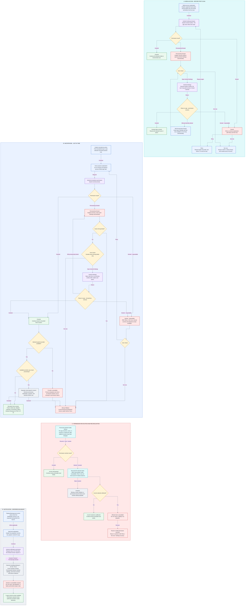

# UF-02 - Permission Denial and Settings Recovery

```mermaid
%%{init: {"theme": "base", "flowchart": {"curve": "stepAfter", "nodeSpacing": 52, "rankSpacing": 72, "htmlLabels": true}, "themeVariables": {"fontFamily": "Inter, Arial, sans-serif", "fontSize": "14px", "lineColor": "#667085", "textColor": "#1F2633"}}}%%
flowchart TB

    subgraph A["A / MEDIA ACCESS - BEFORE FIRST SCAN"]
        direction TB

        A_EXPLAIN["Media-access explanation<br/>Explain supported local-audio access before the OS prompt and before the first scan."]
        A_DIALOG["Android media permission<br/>System-owned surface. The app never infers the result."]
        A_RESULT{"Permission result?"}

        A_GRANTED["Granted<br/>Continue the blocked initial or incremental scan."]
        A_DENIED["Denied<br/>Show a concise explanation with Retry and Not now."]
        A_RETRY["Retry<br/>Request again only after user action; no coercive loop."]
        A_NOT_NOW["Not now<br/>Route to Home / Library Empty with media-access recovery."]

        A_PERMANENT["Permanently Denied<br/>Explain recovery without opening Android Settings automatically."]
        A_PERMANENT_ACTION{"User choice"}
        A_SETTINGS["Android Settings<br/>External system surface; the user may grant access or leave it denied."]
        A_RECHECK{"Return to app - permission recheck"}
        A_STILL_PERMANENT["Still Permanently Denied<br/>Keep Open Settings and Not now available; do not loop automatically."]
        A_GRANTED_AFTER["Granted after recheck<br/>Resume the blocked scan or action."]

        A_EXPLAIN -->|Continue| A_DIALOG
        A_DIALOG --> A_RESULT

        A_RESULT -->|Granted| A_GRANTED
        A_RESULT -->|Denied| A_DENIED
        A_RESULT -->|Permanently Denied| A_PERMANENT

        A_DENIED -->|Retry| A_RETRY
        A_RETRY -->|Request again| A_DIALOG
        A_DENIED -->|Not now| A_NOT_NOW

        A_PERMANENT --> A_PERMANENT_ACTION
        A_PERMANENT_ACTION -->|Open Android Settings| A_SETTINGS
        A_PERMANENT_ACTION -->|Not now| A_NOT_NOW
        A_SETTINGS -->|Return| A_RECHECK
        A_RECHECK -->|Granted| A_GRANTED_AFTER
        A_RECHECK -->|Denied - requestable| A_DENIED
        A_RECHECK -->|Still permanently denied| A_STILL_PERMANENT
        A_STILL_PERMANENT --> A_PERMANENT_ACTION
    end

    subgraph B["B / MICROPHONE - JUST IN TIME"]
        direction TB

        B_ACTION["Explicit microphone action<br/>First microphone tap or user-selected command practice only."]
        B_EXPLAIN["Voice-purpose explanation<br/>Do not request microphone access at blind app start."]
        B_DIALOG["Android microphone permission<br/>System-owned prompt."]
        B_RESULT{"Permission result?"}

        B_GRANTED["Granted<br/>Continue toward a bounded Voice session."]
        B_DENIED["Denied - requestable<br/>Offer Retry or Not now; manual controls and playback remain available."]
        B_DENIED_ACTION{"User choice"}
        B_PERMANENT["Permanently Denied<br/>Explain recovery; never open Settings automatically."]
        B_PERMANENT_ACTION{"User choice<br/>Outside active Driving Mode only"}
        B_DRIVING{"Active Driving Mode?"}
        B_SETTINGS["Android Settings<br/>Open only from a non-driving surface after explicit user action."]
        B_RECHECK{"Return to app - microphone recheck"}

        B_PROVIDER_AVAILABLE{"Selected speech provider available?"}
        B_PROVIDER_UNAVAILABLE["Provider unavailable<br/>Preserve playback and return to manual controls; do not misreport a permission failure."]
        B_PROVIDER{"Available provider uses cloud processing?"}
        B_CLOUD["Separate cloud-speech consent<br/>Disclose processing destination, purpose, and retention before use."]
        B_SESSION["Bounded Voice session<br/>Push-to-Talk only; detailed Listening / Processing / failure behavior belongs to UF-08 / UF-10."]
        B_MANUAL["Manual fallback<br/>Local browsing and playback remain usable without Voice."]

        B_ACTION -->|Continue| B_EXPLAIN
        B_EXPLAIN -->|Request| B_DIALOG
        B_DIALOG --> B_RESULT

        B_RESULT -->|Granted| B_GRANTED
        B_RESULT -->|Denied - requestable| B_DENIED
        B_RESULT -->|Permanently Denied| B_PERMANENT

        B_DENIED --> B_DENIED_ACTION
        B_DENIED_ACTION -->|Retry| B_EXPLAIN
        B_DENIED_ACTION -->|Not now| B_MANUAL
        B_PERMANENT --> B_DRIVING
        B_DRIVING -->|Yes| B_MANUAL
        B_DRIVING -->|No| B_PERMANENT_ACTION
        B_PERMANENT_ACTION -->|Open Android Settings| B_SETTINGS
        B_PERMANENT_ACTION -->|Not now| B_MANUAL
        B_SETTINGS -->|Return| B_RECHECK
        B_RECHECK -->|Granted| B_GRANTED
        B_RECHECK -->|Denied - requestable| B_DENIED
        B_RECHECK -->|Still permanently denied| B_PERMANENT

        B_GRANTED --> B_PROVIDER_AVAILABLE
        B_PROVIDER_AVAILABLE -->|No| B_PROVIDER_UNAVAILABLE
        B_PROVIDER_UNAVAILABLE --> B_MANUAL
        B_PROVIDER_AVAILABLE -->|Yes| B_PROVIDER
        B_PROVIDER -->|No| B_SESSION
        B_PROVIDER -->|Yes| B_CLOUD
        B_CLOUD -->|Accepted| B_SESSION
        B_CLOUD -->|Declined| B_MANUAL
    end

    subgraph C["C / PERMISSION REVOCATION AND RECONCILIATION"]
        direction TB

        C_PREVIOUS["Previously granted media access<br/>The app resumes, scans, or resolves a media item after platform access may have changed."]
        C_RECHECK{"Permission recheck result?"}
        C_VALID["Access still granted<br/>Continue using accessible local media."]
        C_RECONCILE["Reconcile the derived index<br/>Mark inaccessible media unavailable; Room rows are never proof of media existence."]
        C_AFFECTED{"Current selection affected?"}

        C_UNAFFECTED["Current selection unaffected<br/>Continue with accessible local media."]
        C_UNAVAILABLE["Affected item unavailable<br/>Do not crash or display it as playable."]
        C_RECOVERY["Route to media-permission recovery<br/>Return to section A with Retry / Not now / Settings recovery."]
        C_INVARIANT["Invariant<br/>Missing, moved, deleted, or permission-bound media never remains falsely playable."]

        C_PREVIOUS -->|Resume / scan / resolve| C_RECHECK
        C_RECHECK -->|Granted| C_VALID
        C_RECHECK -->|Denied / revoked| C_RECONCILE
        C_RECONCILE --> C_AFFECTED

        C_AFFECTED -->|No| C_UNAFFECTED
        C_AFFECTED -->|Yes| C_UNAVAILABLE
        C_UNAVAILABLE -->|Recover| C_RECOVERY
        C_RECONCILE -->|State invariant| C_INVARIANT
    end

    subgraph D["D / NOTIFICATION - DEFERRED BOUNDARY"]
        direction TB

        D_VALUE["Playback/background-control value exists first<br/>Notification access is not requested during blind first launch."]
        D_EXPLAIN["App-level explanation<br/>Explain why playback controls may appear outside the app."]
        D_DIALOG["Android notification permission<br/>Request only in UF-06 where the Android version requires it."]
        D_ROUTED["Outcome handling belongs to UF-06 / TS-01<br/>Cover Granted, Denied, Permanently Denied, Android Settings, and return recheck with device evidence."]
        D_FAILURE["Denied or unavailable invariant<br/>Do not crash, stop playback, or falsify authoritative player state."]
        D_MANUAL["In-app controls remain available<br/>Permission outcome never authorizes sensitive media telemetry."]

        D_VALUE -->|When applicable| D_EXPLAIN
        D_EXPLAIN -->|Continue| D_DIALOG
        D_DIALOG -->|Granted / Denied / Permanently Denied| D_ROUTED
        D_ROUTED --> D_FAILURE
        D_FAILURE --> D_MANUAL
    end

    A_GRANTED_AFTER ~~~ B_ACTION
    B_MANUAL ~~~ C_PREVIOUS
    C_INVARIANT ~~~ D_VALUE

    classDef action fill:#EAF2FF,stroke:#3776D6,color:#1F2633,stroke-width:1.5px;
    classDef system fill:#F2EBFF,stroke:#7650C7,color:#1F2633,stroke-width:1.5px;
    classDef decision fill:#FFF4D6,stroke:#C68817,color:#1F2633,stroke-width:1.5px;
    classDef success fill:#EAF8EE,stroke:#2E8B4B,color:#1F2633,stroke-width:1.5px;
    classDef recovery fill:#FFE8E8,stroke:#C63B3B,color:#1F2633,stroke-width:1.5px;
    classDef process fill:#E1F9FA,stroke:#16BEC7,color:#1F2633,stroke-width:1.5px;
    classDef note fill:#EEF1F5,stroke:#667085,color:#1F2633,stroke-width:1.5px;

    class A_EXPLAIN,A_RETRY,A_NOT_NOW,A_STILL_PERMANENT,B_ACTION,B_EXPLAIN,D_VALUE,D_EXPLAIN action;
    class A_DIALOG,A_SETTINGS,B_DIALOG,B_SETTINGS,D_DIALOG system;
    class A_RESULT,A_PERMANENT_ACTION,A_RECHECK,B_RESULT,B_DENIED_ACTION,B_PERMANENT_ACTION,B_DRIVING,B_RECHECK,B_PROVIDER_AVAILABLE,B_PROVIDER,C_RECHECK,C_AFFECTED decision;
    class A_GRANTED,A_GRANTED_AFTER,B_GRANTED,B_SESSION,C_VALID,C_UNAFFECTED,D_MANUAL success;
    class A_DENIED,A_PERMANENT,B_DENIED,B_PERMANENT,B_PROVIDER_UNAVAILABLE,B_MANUAL,C_UNAVAILABLE,C_RECOVERY,D_FAILURE recovery;
    class C_PREVIOUS,C_RECONCILE process;
    class B_CLOUD,C_INVARIANT,D_ROUTED note;

    style A fill:#E1F9FA,stroke:#16BEC7,stroke-width:1px
    style B fill:#EAF2FF,stroke:#3776D6,stroke-width:1px
    style C fill:#FFE8E8,stroke:#C63B3B,stroke-width:1px
    style D fill:#EEF1F5,stroke:#667085,stroke-width:1px
```
