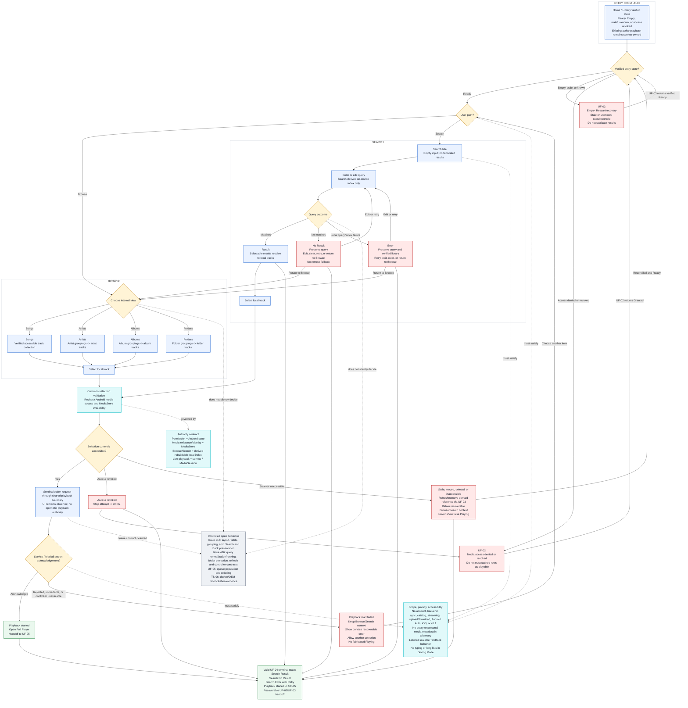

# UF-04 - Browse and Search Local Music

```mermaid
flowchart TB

    subgraph START["ENTRY FROM UF-03"]
        direction TB
        S0["Home / Library verified state\nReady, Empty, stale/unknown, or access revoked\nExisting active playback remains service-owned"]
    end

    A{"Verified entry state?"}
    A1["UF-03\nEmpty: Rescan/recovery\nStale or unknown: scan/reconcile\nDo not fabricate results"]
    A2["UF-02\nMedia access denied or revoked\nDo not trust cached rows as playable"]
    B{"User path?"}

    subgraph BROWSE["BROWSE"]
        direction TB
        B0{"Choose internal view"}
        B1["Songs\nVerified accessible track collection"]
        B2["Artists\nArtist groupings -> artist tracks"]
        B3["Albums\nAlbum groupings -> album tracks"]
        B4["Folders\nFolder groupings -> folder tracks"]
        B5["Select local track"]
    end

    subgraph SEARCH["SEARCH"]
        direction TB
        C0["Search Idle\nEmpty input; no fabricated results"]
        C1["Enter or edit query\nSearch derived on-device index only"]
        C2{"Query outcome"}
        C3["Result\nSelectable results resolve to local tracks"]
        C4["No Result\nPreserve query\nEdit, clear, retry, or return to Browse\nNo remote fallback"]
        C5["Error\nPreserve query and verified library\nRetry, edit, clear, or return to Browse"]
        C6["Select local track"]
    end

    D["Common selection validation\nRecheck Android media access and MediaStore availability"]
    E{"Selection currently accessible?"}
    E1["Access revoked\nStop attempt -> UF-02"]
    E2["Stale, moved, deleted, or inaccessible\nRefresh/remove derived reference via UF-03\nRetain recoverable Browse/Search context\nNever show false Playing"]
    F["Send selection request through shared playback boundary\nUI remains observer; no optimistic playback authority"]
    G{"Service / MediaSession acknowledgement?"}
    G1["Playback started\nOpen Full Player\nHandoff to UF-05"]
    G2["Playback start failed\nKeep Browse/Search context\nShow concise recoverable error\nAllow another selection\nNo fabricated Playing"]

    N1["Authority contract\nPermission = Android state\nMedia existence/identity = MediaStore\nBrowse/Search = derived rebuildable local index\nLive playback = service / MediaSession"]
    N2["Controlled open decisions\nIssue #15: layout, fields, grouping, sort, Search and Back presentation\nIssue #16: query normalization/ranking, folder projection, refresh and controller contracts\nUF-05: queue population and ordering\nTS-06: device/OEM reconciliation evidence"]
    N3["Scope, privacy, accessibility\nNo account, backend, sync, catalog, streaming, upload/download, Android Auto, iOS, or v1.1\nNo query or personal media metadata in telemetry\nLabeled scalable TalkBack behavior\nNo typing or long lists in Driving Mode"]
    T["Valid UF-04 terminal states\nSearch Result\nSearch No Result\nSearch Error with Retry\nPlayback started -> UF-05\nRecoverable UF-02/UF-03 handoff"]

    S0 --> A
    A -->|Ready| B
    A -->|Empty, stale, unknown| A1
    A -->|Access denied or revoked| A2
    A1 -->|UF-03 returns verified Ready| A
    A2 -->|UF-02 returns Granted| A

    B -->|Browse| B0
    B0 -->|Songs| B1
    B0 -->|Artists| B2
    B0 -->|Albums| B3
    B0 -->|Folders| B4
    B1 --> B5
    B2 --> B5
    B3 --> B5
    B4 --> B5

    B -->|Search| C0
    C0 --> C1
    C1 --> C2
    C2 -->|Matches| C3
    C2 -->|No matches| C4
    C2 -->|Local query/index failure| C5
    C4 -->|Edit or retry| C1
    C5 -->|Edit or retry| C1
    C4 -->|Return to Browse| B0
    C5 -->|Return to Browse| B0
    C3 --> C6

    B5 --> D
    C6 --> D
    D --> E
    E -->|Yes| F
    E -->|Access revoked| E1
    E -->|Stale or inaccessible| E2
    E1 --> A2
    E2 -->|Reconciled and Ready| A
    F --> G
    G -->|Acknowledged| G1
    G -->|Rejected, unreadable, or controller unavailable| G2
    G2 -->|Choose another item| B

    C3 --> T
    C4 --> T
    C5 --> T
    G1 --> T
    E1 --> T
    E2 --> T

    D -.governed by.-> N1
    B0 -.does not silently decide.-> N2
    C2 -.does not silently decide.-> N2
    F -.queue contract deferred.-> N2
    B -.must satisfy.-> N3
    C0 -.must satisfy.-> N3
    G -.must satisfy.-> N3

    classDef action fill:#EAF2FF,stroke:#3776D6,color:#1F2633,stroke-width:1.5px;
    classDef decision fill:#FFF4D6,stroke:#C68817,color:#1F2633,stroke-width:1.5px;
    classDef process fill:#E1F9FA,stroke:#16BEC7,color:#1F2633,stroke-width:1.5px;
    classDef success fill:#EAF8EE,stroke:#2E8B4B,color:#1F2633,stroke-width:1.5px;
    classDef recovery fill:#FFE8E8,stroke:#C63B3B,color:#1F2633,stroke-width:1.5px;
    classDef note fill:#EEF1F5,stroke:#667085,color:#1F2633,stroke-width:1.5px;

    class S0,B1,B2,B3,B4,B5,C0,C1,C3,C6,F action;
    class A,B,B0,C2,E,G decision;
    class D,N1,N3 process;
    class G1,T success;
    class A1,A2,C4,C5,E1,E2,G2 recovery;
    class N2 note;

    style START fill:transparent,stroke:#C7CED9,stroke-width:1px
    style BROWSE fill:transparent,stroke:#C7CED9,stroke-width:1px
    style SEARCH fill:transparent,stroke:#C7CED9,stroke-width:1px
```
